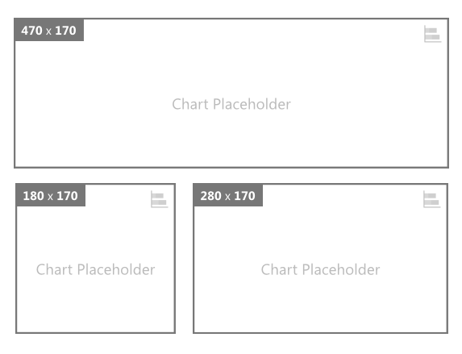

# Chart Placeholder for Power BI

Chart Placeholder by OKViz simplifies prototyping and alignment of charts in your reports. You can use it in the prototyping phase, allocating the available space of your canvas to different elements that you will configure later.

Find out more on http://okviz.com/chart-placeholder/

### Copyrights

Copyright (c) 2016-2017 OKViz - trademark of SQLBI Corp.

See the [LICENSE](/LICENSE) file for license rights and limitations (MIT).